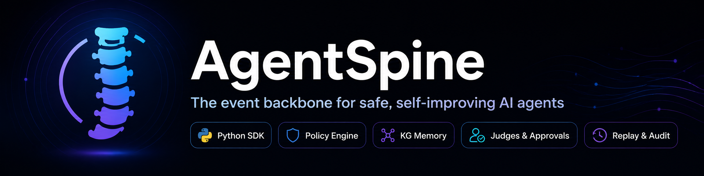

<div align="center">

<br>


</div>

> Open-source adaptive control plane for production AI agents.

AgentSpine is an embedded Python SDK that sits between your AI agents and the tools they use — enforcing policies, preventing duplicates, managing locks, scoring risk, and logging every action for full observability.

## Features

- **Policy Engine** — Declarative rules that deny, allow, or require approval for agent actions
- **Semantic Deduplication** — Prevent agents from repeating the same action using embedding similarity
- **Distributed Locks** — Prevent two agents from modifying the same resource simultaneously
- **Risk Scoring** — Score every action on a 0–1 scale and route to fast-path, judiciary, or human approval
- **Knowledge Graph** — Track relationships between agents, actions, tools, and resources
- **Credential Vault** — Encrypted at-rest storage for API keys and OAuth tokens
- **Event Timeline** — Append-only audit log of every action and decision
- **Rate Limiting & Circuit Breakers** — Per-agent, per-tool, per-workflow limits
- **Feature Flags** — Enable only the subsystems you need; disable the rest for zero overhead

## Quickstart

```bash
# Start infrastructure
docker compose up -d

# Install SDK
pip install agentspine[all]
```

```python
import asyncio
from agentspine import AgentSpine

async def main():
    spine = AgentSpine(workflow="demo")

    async def local_echo(payload, context):
        return {"echo": payload}

    spine.register_tool("demo.echo", local_echo)

    result = await spine.request_action(
        agent="demo_agent",
        action_type="demo.echo",
        payload={"text": "Hello from AgentSpine!"},
        idempotency_key="demo_001",
    )
    print(f"Status: {result.status}")
    await spine.close()

asyncio.run(main())
```

If no local tool is registered for an action type, AgentSpine emits a normalized execution signal so an external
worker or service can perform the real side effect and report the result back later.

## Feature Flags

```python
from agentspine import AgentSpine
from agentspine.features import FeatureFlags

# Full mode (default) — all features on
spine = AgentSpine(workflow="my_workflow")

# Standard — no KG or judiciary
spine = AgentSpine(workflow="my_workflow", features=FeatureFlags.standard())

# Minimal — policy + events only
spine = AgentSpine(workflow="my_workflow", features=FeatureFlags.minimal())
```

## Architecture

```
Agent → AgentSpine SDK → Pipeline → Tool
           │
           ├── Policy Engine (allow/deny/approve)
           ├── Semantic Dedupe (pgvector)
           ├── Risk Scorer (0-1 score)
           ├── Knowledge Graph (Postgres)
           ├── Distributed Locks (Redis)
           └── Event Timeline (append-only)
```

## Requirements

- Python 3.11+
- PostgreSQL 16+ (with pgvector extension)
- Redis 7+ (optional, for locks/rate-limiting/circuit-breakers)

## Documentation

- [Quickstart](docs/quickstart.md)
- [Architecture](docs/architecture.md)
- [Deployment](docs/deployment.md)
- [Plugins](docs/plugins.md)
- [API Reference](docs/api-reference.md)

## Contributing

See [CONTRIBUTING.md](CONTRIBUTING.md) for development setup and guidelines.

## License

Apache 2.0 — See [LICENSE](LICENSE).
